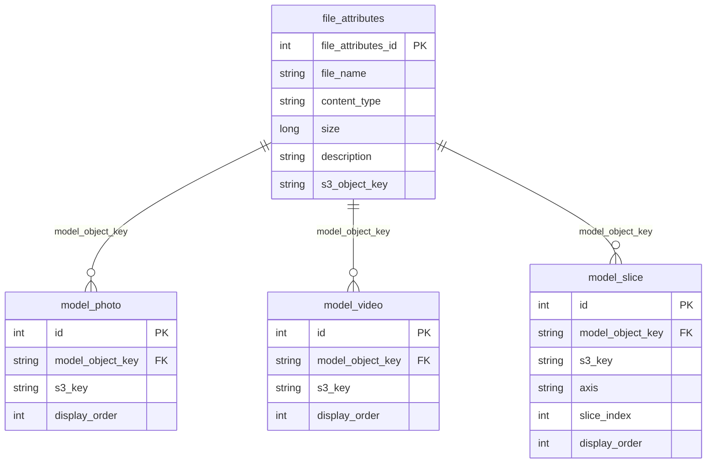
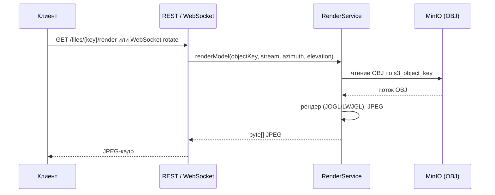
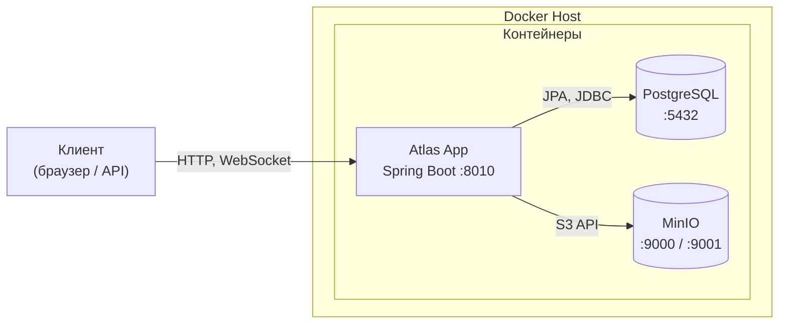

# ГЛАВА 2. ПРОЕКТ РЕШЕНИЯ

## 2.1 Архитектура программного комплекса

Программный комплекс «Atlas» спроектирован как серверное приложение для хранения, обработки и потоковой визуализации 3D-моделей (OBJ-формат). В основу архитектурного решения заложен принцип разделения ответственности (Separation of Concerns), что позволяет независимо развивать и масштабировать компоненты серверной части.

### 2.1.1 Компонентная структура системы

Общая архитектура решения включает в себя следующие ключевые компоненты, оркестрация которых осуществляется посредством Docker Compose:

1. **Backend Server (Spring Boot API):** Центральное звено системы, реализованное на фреймворке Spring Boot (Java 21). Предоставляет RESTful API для работы с 3D-моделями и метаданными (описание, фото, видео, срезы), а также WebSocket для потоковой передачи кадров рендера. Интегрирует бизнес-логику с PostgreSQL и MinIO.

2. **Инфраструктурные сервисы:** Контейнеризированные экземпляры PostgreSQL (основная БД для метаданных), MinIO (S3-совместимое хранилище OBJ-файлов и медиа: фото, видео, срезы).

### 2.1.2 Организация среды развертывания и взаимодействия

Для обеспечения идентичности сред разработки и эксплуатации используется контейнеризация на базе Docker Compose. Взаимодействие между компонентами организовано следующим образом:

1. **Application Server:** Spring Boot приложение слушает порт 8010, обслуживает REST-запросы и WebSocket. Роль единой точки входа выполняет само приложение; статические ресурсы при необходимости раздаются из classpath:/static.

2. **Data Persistence:** Реляционные данные сохраняются в томах (volumes) PostgreSQL. На уровне кода используется ORM Spring Data JPA (Hibernate). В БД хранятся метаданные моделей (file_attributes), связи с медиа (model_photo, model_video, model_slice).

3. **Storage:** OBJ-файлы 3D-моделей и медиафайлы (фото, видео, изображения срезов) хранятся в S3-совместимом хранилище MinIO. Это разгружает основной сервер от обработки больших бинарных файлов и обеспечивает масштабируемое хранилище.

4. **Серверный рендеринг:** Для визуализации 3D-моделей используется JOGL (Java OpenGL) или LWJGL. Рендер выполняется на сервере в offscreen-режиме; запрашивающая сторона получает только JPEG-кадры по WebSocket, что защищает исходные OBJ-файлы от прямого скачивания.

Взаимодействие клиентских приложений с бэкендом осуществляется по REST API и WebSocket. REST обеспечивает список моделей, загрузку/удаление, управление метаданными и статичные кадры рендера; WebSocket (`/ws/render/{modelId}`) — потоковую передачу кадров при вращении модели.

### 2.1.3 Физическое хранение файлов

Файловая инфраструктура организована по следующему принципу:

- **OBJ-файлы** хранятся в MinIO по ключу `s3_object_key` (прямая ссылка на файл в бакете).
- **Медиаконтент** организован в структуру каталогов внутри MinIO:
  - `media/photos/` — фотографии моделей;
  - `media/videos/` — видеообзоры моделей;
  - `media/slices/` — файлы срезов (по осям X, Y, Z).
- Связь медиа с моделью задаётся полем **model_object_key** (ключ модели в MinIO).

---

## 2.2 Проектирование структуры данных и связей

Для обеспечения надёжного хранения информации и поддержки транзакционной целостности данных (ACID) в проекте используется реляционная СУБД PostgreSQL. Логическая структура базы данных спроектирована с учётом нормализации для минимизации избыточности и обеспечения высокой скорости выполнения запросов.

### 2.2.1 Основные сущности и иерархия данных

Все таблицы базы данных и их атрибуты используют формат именования snake_case. Основные сущности системы можно разделить на два логических блока:

1. **Блок метаданных и моделей:**
   1.1. **file_attributes** — метаданные загруженных OBJ-файлов (file_name, content_type, size, description, s3_object_key). Используется для хранения описания модели и связи с MinIO.
   
2. **Блок медиаконтента:**
   2.1. **model_photo** — привязка фотографий к модели (model_object_key, s3_key, display_order).
   2.2. **model_video** — привязка видео к модели (model_object_key, s3_key, display_order).
   2.3. **model_slice** — привязка срезов модели (model_object_key, s3_key, axis, slice_index, display_order).

OBJ-файлы моделей хранятся в MinIO по ключу (s3_object_key). Медиафайлы — в каталогах media/photos, media/videos, media/slices; в БД сохраняются s3_key и связь с моделью через model_object_key.

### 2.2.2 Отношения между сущностями

Взаимодействие таблиц реализовано через строковый идентификатор model_object_key (s3ObjectKey модели в MinIO). Связи имеют следующий характер:

**Один-ко-многим (One-to-Many):** Одна модель (file_attributes) может иметь множество связанных записей в model_photo, model_video и model_slice. При удалении модели выполняется каскадное удаление связанных записей и соответствующих файлов в MinIO.

На рисунке 2.2 приведена схема связей сущностей между собой.

**Рисунок 2.2 — Связи между сущностями базы данных**

---

## 2.3 API и интерфейсы

### 2.3.1 REST API

Документация API доступна через Swagger UI: `http://<host>:8010/swagger-ui.html`. В таблице 2.1 перечислены основные методы REST API.

**Таблица 2.1 — Основные методы REST API**

| Метод   | Путь | Назначение |
|--------|------|------------|
| GET    | /files | Список всех 3D-моделей |
| GET    | /files/{objectKey} | Информация о модели |
| POST   | /files/upload | Загрузка OBJ-модели |
| DELETE | /files/{objectKey} | Удаление модели и связанных медиа |
| GET    | /files/{objectKey}/render | Статичный кадр рендера (JPEG) |
| GET    | /files/{objectKey}/meta | Метаданные (описание, фото, видео, срезы) |
| PATCH  | /files/{objectKey}/meta | Обновление описания модели |
| POST   | /files/{objectKey}/photos | Загрузка фото к модели |
| POST   | /files/{objectKey}/videos | Загрузка видео к модели |
| POST   | /files/{objectKey}/slices | Загрузка срезов к модели |
| GET    | /files/{objectKey}/media/photo/{id} | Получение изображения фото |
| GET    | /files/{objectKey}/media/video/{id} | Получение видео |
| GET    | /files/{objectKey}/media/slice/{id} | Получение изображения среза |

**WebSocket:** `ws://<host>:8010/ws/render/{modelId}` — потоковая передача кадров рендера при вращении модели.

**File Controller (детально):**
- `GET /files` — список всех моделей.
- `GET /files/{objectKey}` — информация о модели.
- `POST /files/upload` — загрузка OBJ-модели (multipart/form-data).
- `DELETE /files/{objectKey}` — удаление модели и связанных медиа.
- `GET /files/{objectKey}/render?azimuth=&elevation=` — статичный кадр рендера (JPEG).

**Model Meta Controller:**
- `GET /files/{objectKey}/meta` — метаданные (описание, фото, видео, срезы) с URL для доступа к медиа.
- `PATCH /files/{objectKey}/meta` — обновление описания.
- `POST /files/{objectKey}/photos`, `DELETE /files/{objectKey}/photos/{id}` — загрузка и удаление фото.
- `POST /files/{objectKey}/videos`, `DELETE /files/{objectKey}/videos/{id}` — загрузка и удаление видео.
- `POST /files/{objectKey}/slices`, `DELETE /files/{objectKey}/slices/{id}` — загрузка и удаление срезов.
- `GET /files/{objectKey}/media/photo/{id}` — получение изображения фото.
- `GET /files/{objectKey}/media/video/{id}` — получение видео.
- `GET /files/{objectKey}/media/slice/{id}` — получение изображения среза.

### 2.3.2 WebSocket API

**Эндпоинт:** `ws://<host>:8010/ws/render/{modelId}`

Клиент отправляет JSON: `{ "type": "rotate", "azimuth": <число>, "elevation": <число>, "final": <bool> }`. Сервер возвращает бинарное сообщение — JPEG-кадр рендера. Потоковая передача позволяет реализовать плавное вращение модели без множественных HTTP-запросов.

### 2.3.3 Сценарий запроса кадра рендера

Ниже приведена последовательность взаимодействия компонентов при запросе клиентом кадра рендера 3D-модели (статичный HTTP или поток по WebSocket).

**Рисунок 2.4 — Диаграмма последовательности: запрос кадра рендера**

---

## 2.4 Конфигурация развертывания

Конфигурация задаётся через переменные окружения и application.properties. Для локального запуска с внешними MinIO и PostgreSQL используется профиль `local` и файл `docker-compose.override.vm.example`. Ограничения рендера (разрешение, FPS) настраиваются через `RENDER_WIDTH`, `RENDER_HEIGHT`, `RENDER_STREAM_FPS` для снижения нагрузки на CPU при работе в контейнере без GPU.

На рисунке 2.5 показана среда развёртывания: взаимодействие контейнеров приложения, PostgreSQL и MinIO в рамках Docker Compose.

**Рисунок 2.5 — Среда развёртывания (Docker Compose)**

