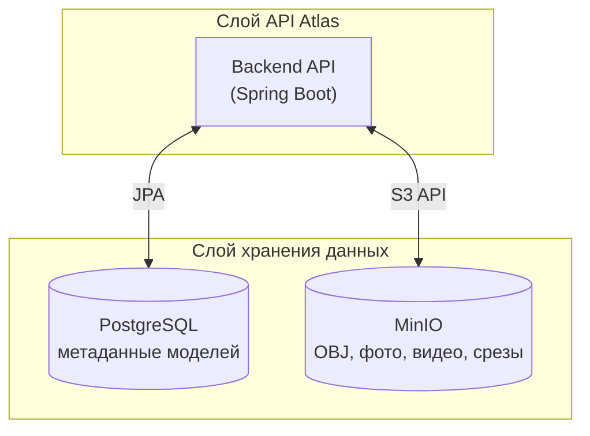

# 2.1 Архитектура программного комплекса

## Рисунок — Архитектурная схема бэкенда Atlas

### Mermaid-диаграмма (для рендера в Markdown/диаграммах)

## Текстовая схема для Word/дипломной работы

**Слой API:**
- **Backend API (Spring Boot)** — REST-сервис Atlas. Обработка запросов к списку и загрузке 3D-моделей, управление метаданными (описание, фото, видео, срезы), WebSocket для потоковой передачи кадров рендера.

**Слой хранения:**
- **PostgreSQL** — метаданные моделей (описание, связи с фото, видео, срезами).
- **MinIO** — OBJ-файлы 3D-моделей, медиафайлы (фото, видео, изображения срезов).

**Потоки данных:**
- Spring Boot ↔ PostgreSQL (JPA).
- Spring Boot ↔ MinIO (S3-клиент).

---

## Краткое описание для подписи к рисунку

**Рисунок — Архитектурная схема бэкенда программного комплекса Atlas**

Бэкенд построен по двухуровневой архитектуре: серверное API на Spring Boot и слой хранения данных. PostgreSQL используется для метаданных моделей, MinIO — для OBJ-файлов и медиа (фото, видео, срезы). REST API обеспечивает работу с моделями и медиа; WebSocket — потоковую передачу кадров 3D-рендера.
